# Strona tytułowa

**Tytuł projektu:**  
**🎬 Predykcja ocen filmów na podstawie tagów i gatunków**


**Uczestnicy projektu:**  
- **Marko Golovko** – nr albumu: s31056 – grupa: 11c  
- **Mateusz Durak** – nr albumu: s21415 – grupa: 11c
- **Arkadiusz Stryjewski** - nr albumu: s32415 – grupa: 11c

**Podział pracy:**  
- Marko Golovko: Przygotowanie danych, trenowanie modelu Random Forest, raport końcowy
- Mateusz Durak: Trenowanie modelu XGBoost, ewaluacja modelu
- Arkadiusz Stryjewski: Integracja z PySpark, obliczenia TF-IDF

**Repozytorium projektu:**  
[https://github.com/GameRuiner/movie-rating](https://github.com/GameRuiner/movie-rating)

---

# Spis treści

1. Wstęp i cel badania
2. Opis danych  
3. Metodologia i rozwiązanie  
4. Metoda oceny jakości modelu
5. Wyniki eksperymentalne
6. Podsumowanie i wnioski 
7. Eksperyment z modelem XGBoost i rozszerzonym feature engineering

---

## 1. Wstęp i cel badania

Celem badania było stworzenie modelu regresyjnego, który na podstawie informacji o filmie (gatunki oraz przypisane tagi użytkowników) potrafi przewidywać ocenę, jaką użytkownik mógłby wystawić danemu filmowi. Projekt ten może znaleźć zastosowanie w systemach rekomendacji, gdzie precyzyjne przewidywanie ocen jest kluczowe dla jakości rekomendacji.


## 2. Opis danych

### Źródła danych:

Wykorzystano [MovieLens Latest Datasets](https://grouplens.org/datasets/movielens/latest/).

- movies.csv – metadane filmów, w tym tytuły i gatunki,
- tags.csv – tagi przypisane przez użytkowników do filmów,
- ratings.csv – rzeczywiste oceny użytkowników.

### Cechy danych:

- Liczba filmów: ~9 000
- Liczba rekordów z ocenami: ~100 000
- Liczba gatunków filmowych: 20+
- Liczba tagów (po ekstrakcji TF-IDF): 300
- Liczba końcowych cech (połączenie gatunków i tagów): ok. 320


### Rozkład zmiennej decyzyjnej (oceny):

- Skala ocen: od 0.5 do 5.0 (w krokach co 0.5)
- Typ predykcji: regresja (zmienna ciągła)


## 3. Metodologia i rozwiązanie

1. **Przygotowanie danych:**
-	**Pobranie i rozpakowanie danych:** Automatyczne pobranie zbioru MovieLens ze strony GroupLens i rozpakowanie pliku ZIP.

- **Wczytanie danych z użyciem PySparka:**
Do wczytania plików movies.csv oraz tags.csv wykorzystano PySpark (SparkSession), który umożliwia przetwarzanie danych w rozproszony sposób. Dzięki temu rozwiązaniu kod może skalować się do większych zbiorów danych i być uruchamiany na klastry Spark.
Przykładowo, dane z pliku tags.csv zostały zgrupowane z użyciem PySpark:

```python
tags_spark.groupBy("movieId").agg(concat_ws(" ", collect_list("tag")).alias("tag"))
```

To pozwoliło na efektywne połączenie tagów w jedną kolumnę tekstową dla każdego filmu.

- **Przetwarzanie gatunków filmowych (pandas):**
Kolumna genres została przekształcona do postaci binarnej (one-hot encoding) za pomocą funkcji get_dummies, co pozwoliło reprezentować każdy gatunek jako oddzielną cechę.

- **Tworzenie reprezentacji tekstowej tagów:**
Po połączeniu tagów, tekst został przekształcony do wektorów cech za pomocą *TfidfVectorizer* z biblioteki *scikit-learn*, ograniczając liczbę cech do 300 najczęstszych słów (ignorując tzw. stop words w języku angielskim).

- **Utworzenie końcowej ramki danych:**
Wszystkie cechy (ID filmu, tytuł, gatunki, tagi TF-IDF) zostały połączone w jeden zbiór danych final_df, który następnie zapisano do pliku CSV movies_with_tags_features.csv.

2. **Budowa zbioru uczącego:**
- Połączono oceny użytkowników z cechami filmów.
- Usunięto cechy niezwiązane z treścią filmu (userId, movieId, title, timestamp).
- Podzielono dane na zbiór treningowy i testowy (80/20).

3. **Modelowanie:**
- Użyto modelu Random Forest Regressor z 100 drzewami decyzyjnymi (n_estimators=100).
- Model trenowano na zestawie treningowym.

## 4. Metoda oceny jakości modelu

Do oceny jakości modelu wykorzystano standardowe metryki regresji:
- **RMSE (Root Mean Squared Error):** miara błędu średniokwadratowego – premiuje duże błędy.
- **MAE (Mean Absolute Error):** średni błąd bezwzględny – bardziej odporny na outliery.

## 5. Wyniki eksperymentalne

### Wyniki:

- ✅ **RMSE:** 0.984
- ✅ **MAE:** 0.772

### Wizualizacje:

**🔍 Rozkład reszt (różnic między prawdziwymi a przewidywanymi ocenami):**

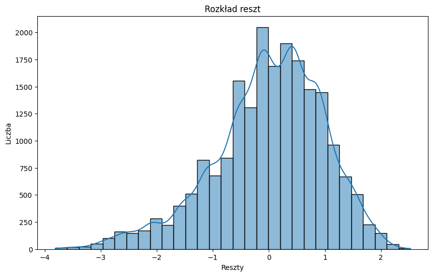

**📊 Błąd bezwzględny względem prawdziwej oceny:**

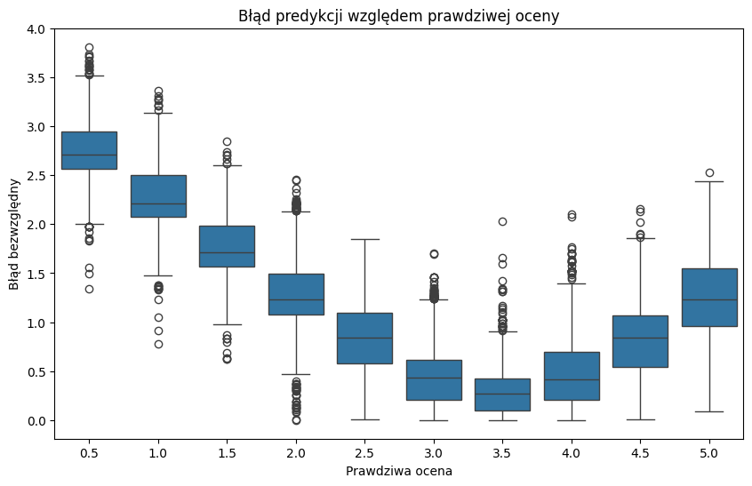

**🌟 15 najważniejszych cech wpływających na ocenę filmu:**

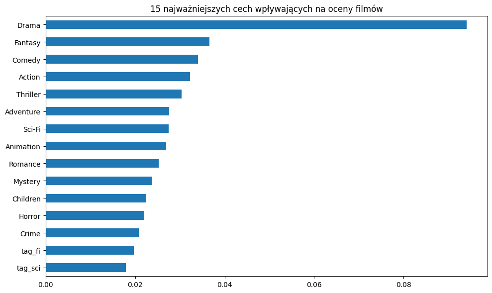

## 6. Podsumowanie i wnioski

- Model **Random Forest** uzyskał **dobrą jakość predykcji** ocen filmów wyłącznie na podstawie ich treści (gatunki i tagi), bez uwzględniania informacji o użytkowniku.
- TF-IDF okazało się skuteczne w przetwarzaniu tagów i tworzeniu reprezentacji tekstowej.
- Analiza ważności cech może posłużyć do interpretacji, które gatunki i tagi najbardziej wpływają na przewidywane oceny.
- Możliwości dalszej pracy:
    - Uwzględnienie informacji o użytkownikach (filtry kolaboracyjne).
    - Użycie nowszych modeli, np. XGBoost, LightGBM lub sieci neuronowych.
    - Redukcja liczby cech przy zachowaniu jakości predykcji (np. PCA, selekcja cech).

## Eksperyment z modelem XGBoost i rozszerzonym feature engineering

W ramach rozszerzenia projektu przeprowadzono także eksperyment z użyciem modelu **XGBoost Regressor**. W porównaniu do poprzednio opisanego podejścia, zastosowano tu zmodyfikowany zestaw cech oraz inne techniki oceny skuteczności predykcji.

### Różnice w feature engineering

W modelu XGBoost, oprócz binarnych kolumn gatunków oraz reprezentacji tagów TF-IDF, wykorzystano także:

- `num_genres` – liczbę gatunków przypisanych do filmu,
- `tag_count` – liczbę tagów powiązanych z filmem,
- `title_length` – długość tytułu (liczba znaków),
- `year` – rok produkcji filmu (wyodrębnioną z tytułu).
- `decade` – dekadę produkcji filmu (wyodrębnioną z roku).

Dzięki temu zbiór cech został wzbogacony o atrybuty ilościowe oraz cechy wyciągnięte w procesie analizy tekstu. Przykładowe rozkłady oraz wpływ tych cech na dane i wynik predykcji pokazują poniższe wykresy:

- Liczba filmów względem liczby przypisanych gatunków:  
  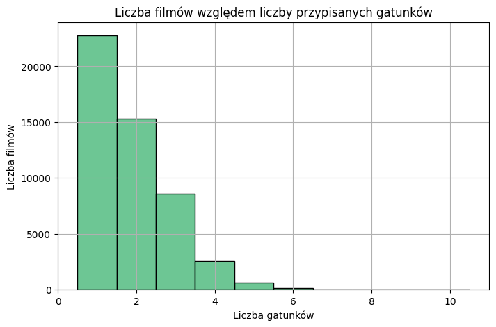
- Liczba filmów w poszczególnych gatunkach:  
  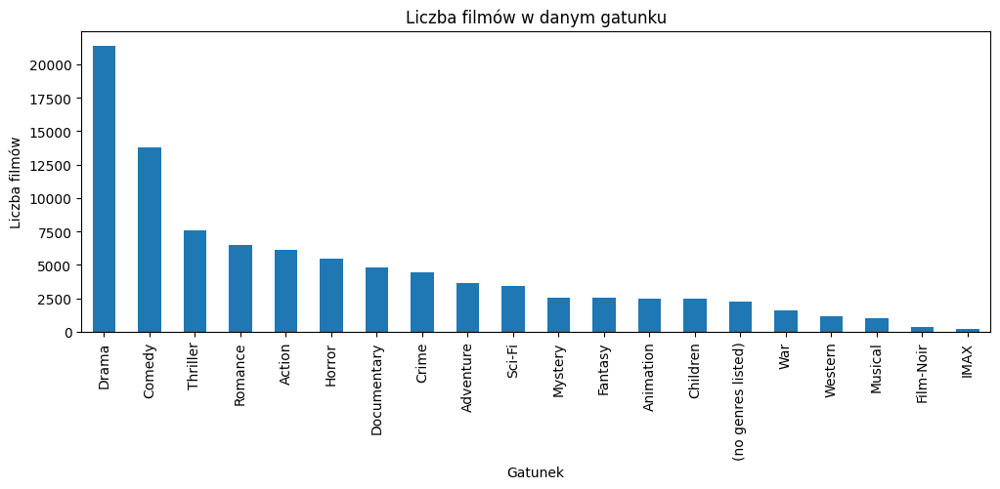
- Średnia ocena filmu względem dekady produkcji:  
  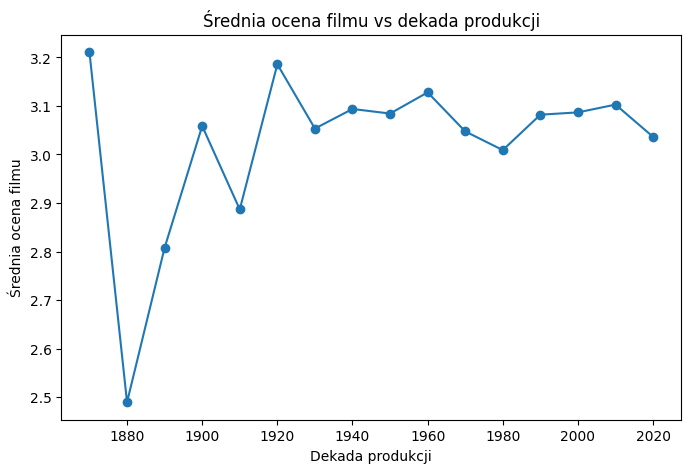
- Korelacja engineered features z oceną:  
  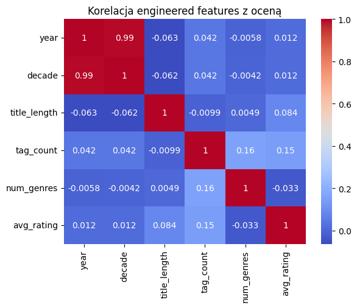
- Korelacja gatunków z oceną:  
  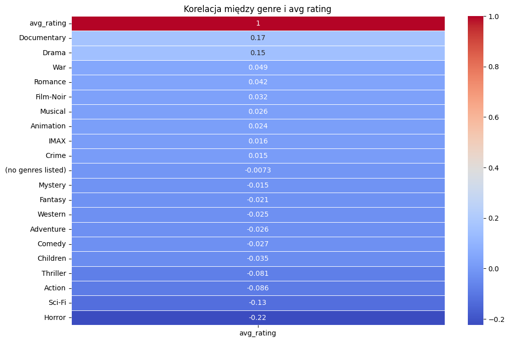

### Metody oceny modelu

Model XGBoost oceniono przy użyciu następujących metryk:

- **MSE**
- **RMSE**
- **MAE**
- **R^2**

Zastosowano podział zbioru na część treningową (80%) i testową (20%).

### Wyniki modelu XGBoost

- **MSE:** 0.3301
- **RMSE:** 0.5745
- **MAE:** 0.4058
- **R²:** 0.2539

Histogram rozkładu średnich ocen filmów dla nowego zbioru cech prezentuje poniższy wykres:

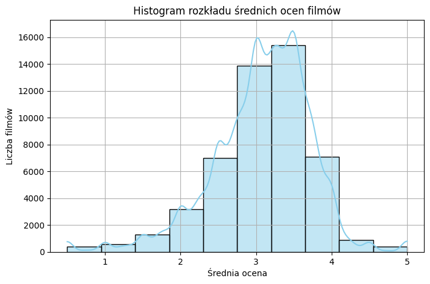

### Analiza błędów i ważności cech

Zaobserwowano, że średni błąd predykcji modelu zależy od liczby tagów przypisanych do filmu:

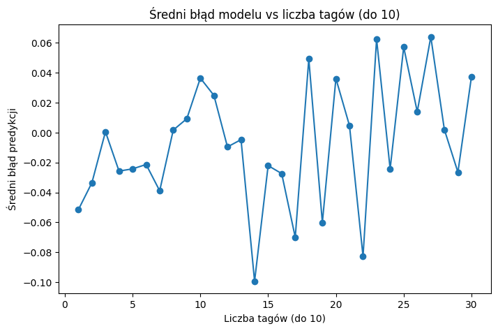

Ranking najważniejszych cech dla modelu XGBoost przedstawiono poniżej:

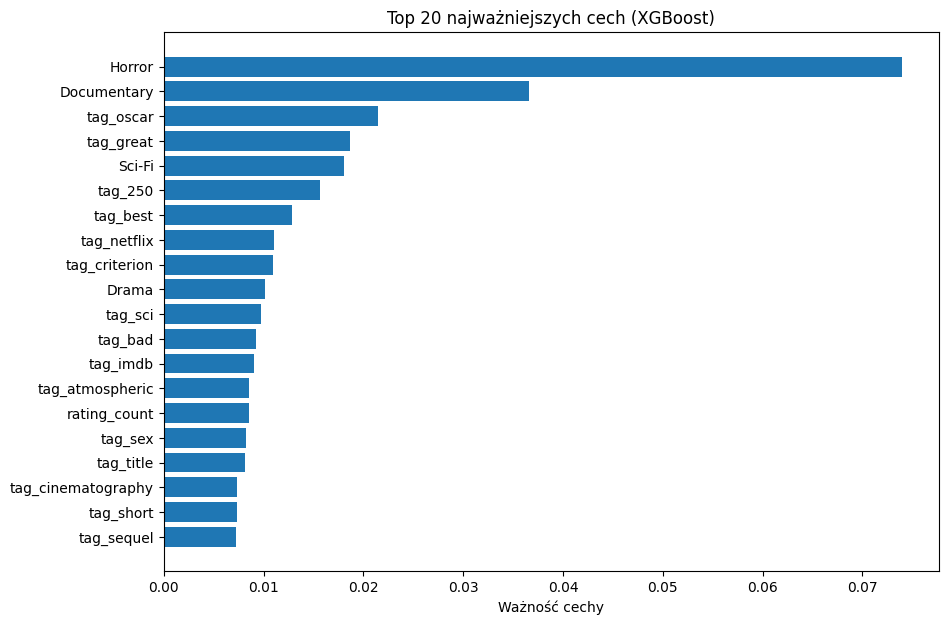

### Podsumowanie różnic względem podejścia bazowego

- Zastosowanie modelu XGBoost pozwoliło na uwzględnienie nieliniowych zależności pomiędzy cechami a oceną filmu.
- W porównaniu do poprzedniego pipeline'u, poprawiono dokładność predykcji (spadek RMSE).
- Rozbudowana analiza korelacji i ranking ważności cech wskazują, które cechy mają największy wpływ na końcowy wynik modelu.

Wszystkie powyższe wykresy znajdują się w folderze `charts/` repozytorium.

### 🔄 PySpark + XGBoost

Model trenowany w klastrze Spark na **pełnym** zbiorze.  
Aby zmieścić wiele surowych cech w pamięci, zastosowano w dwóch przypadkach PCA - dla genomu tagów (pc_) oraz tagów nadanych przez użytkowników (pca_) – w zestawieniu ważności cech dominują czynniki PCA dla genomów tagów.

**XGBoost (sklearn)**

R² = 0.254
RMSE = 0.575
MAE = 0.406

**PySpark + XGBoost (hist) z PCA (50 komponentów)**

R² = 0.150
RMSE = 0.986
MAE = 0.743
MAPE = 35.4 %


* **Jakość predykcji**: przy pełnym zbiorze i PCA wynik zbliżony do lasu losowego – R² ≈ 0.15, RMSE ≈ 1 klasa; nadal słabszy niż gęsty XGBoost z wcześniejszego eksperymentu.  
* **Skalowalność**: klaster Spark (96 workerów, `tree_method="hist"`) pozwolił trenować bez próbkowania.  
* **Ważność cech**: pierwszy komponent (`pc_1`) zbiera większość zysku podziałów; pojedyncze oryginalne gatunki (np. **Horror**) wciąż wnoszą mierzalny wkład.

**Wniosek**  
Intensywne stosowanie PCA rzeczywiście umożliwia trening na znacznie większych zbiorach danych w rozproszeniu, ale dużym kosztem dokładności. Niemniej jednak może to podnieść umiejętność generalizacji predyktora na nowe przypadki.
